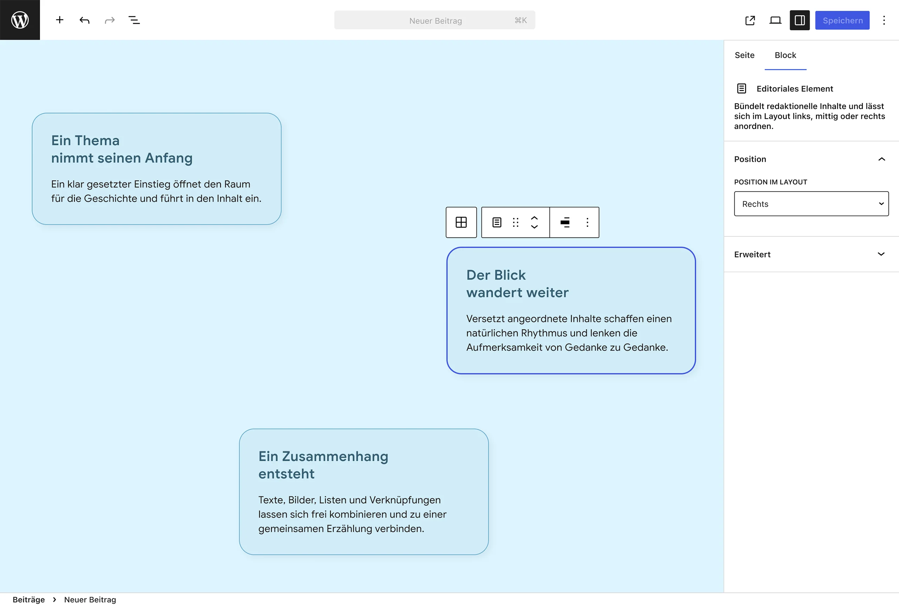
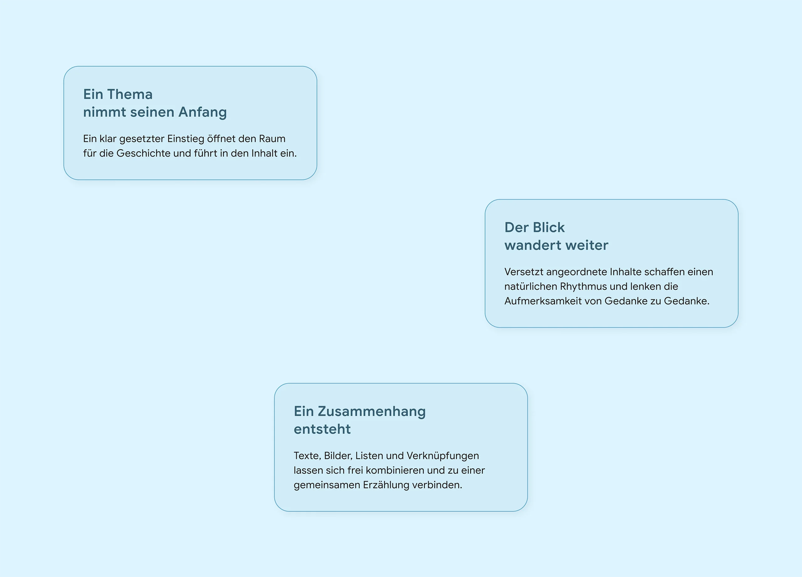

# UD Block: Editoriales Layout

WordPress-Block-Plugin für versetzt angeordnete Inhalte in editorialen Seitenlayouts.

Das Plugin verbindet eine klare Blockstruktur mit einer einfachen Positionswahl. Redaktionelle Elemente werden links, mittig oder rechts angeordnet und schaffen so einen abwechslungsreichen visuellen Lesefluss.

## Zweck

Editoriale Seiten leben von Rhythmus, Gewichtung und bewusst gesetzten Freiräumen. Dieses Plugin stellt dafür zwei aufeinander abgestimmte Gutenberg-Blöcke bereit:

- **Editoriales Layout** bildet den gemeinsamen Container.
- **Editoriales Element** bündelt die Inhalte und erhält seine Position innerhalb des Layouts.

Die Redaktion arbeitet mit vertrauten WordPress-Blöcken und steuert die Anordnung über drei verständliche Positionen.

## Blöcke

### Editoriales Layout

Übergeordneter Container für beliebig viele editoriale Elemente.

- nimmt gezielt Blöcke vom Typ `ud/editorial-item` auf
- hält Reihenfolge und Layoutbezug der Elemente zusammen
- unterstützt einen individuellen HTML-Anker
- stellt den Rahmen für die gemeinsame Frontend-Darstellung bereit

### Editoriales Element

Inhaltselement innerhalb des Editorialen Layouts.

- steht innerhalb von `ud/editorial-layout` zur Verfügung
- lässt sich links, mittig oder rechts anordnen
- speichert die gewählte Position als Block-Attribut
- unterstützt Absätze, Überschriften, Listen, Bilder und Buttons
- zeigt die gewählte Position direkt im Editor

## Bedienung im Editor

Ist ein Editoriales Element ausgewählt, kann seine Position über die Block-Werkzeugleiste oder im Inspector unter **Position → Position im Layout** geändert werden. Die Auswahl wird unmittelbar in der Editor-Vorschau sichtbar.



*Die Redaktion positioniert jedes Element links, mittig oder rechts und gestaltet seinen Inhalt mit ausgewählten WordPress-Blöcken.*

## Darstellung im Frontend

Im Frontend bilden die nacheinander gesetzten Positionen einen zusammenhängenden Lesefluss. Die Blockstruktur liefert Position und Reihenfolge; das Projekt-Theme kann Farben, Typografie, Abstände und weitere gestalterische Merkmale definieren.



*Die wechselnde Anordnung führt den Blick durch die Inhalte und überträgt die im Editor gewählte Position in das Frontend.*

## Technische Grundlage

Das Plugin verwendet:

- WordPress Block Editor
- React / JSX
- `InnerBlocks` mit gezielt zugelassenen Blocktypen
- Block API Version 3
- `block.json` für die Block-Registrierung
- SCSS für Editor- und Frontend-Styles
- Webpack und `@wordpress/scripts` für den Build

Die beiden Blöcke speichern ihre Ausgabe statisch. Das Positions-Attribut des Editorialen Elements wird als Klasse `is-position-left`, `is-position-center` oder `is-position-right` ausgegeben.

## Struktur

```text
ud-editorial-layout-block/
├── assets/
├── build/
├── includes/
│   ├── block-register.php
│   ├── enqueue.php
│   ├── helpers.php
│   └── render.php
├── src/
│   ├── blocks/
│   │   ├── editorial-item/
│   │   └── editorial-layout/
│   └── css/
├── package.json
├── package-lock.json
├── webpack.config.js
└── ud-editorial-layout-block.php
```

## Entwicklung

Abhängigkeiten installieren:

```bash
npm install
```

Entwicklungsmodus starten:

```bash
npm run start
```

Produktions-Build erstellen:

```bash
npm run build
```

## Weiterführender Beitrag

Wie aus frei kombinierbaren Gutenberg-Blöcken ein rhythmisches Inhaltslayout entsteht, zeigt der Beitrag [Editoriale Inhaltslayouts im Gutenberg-Editor flexibel gestalten](https://ulrich.digital/editoriale-inhaltslayouts-im-gutenberg-editor-flexibel-gestalten/).

## Autor

[ulrich.digital gmbh](https://ulrich.digital)

## Lizenz

GPL v2 or later
[https://www.gnu.org/licenses/gpl-2.0.html](https://www.gnu.org/licenses/gpl-2.0.html)
